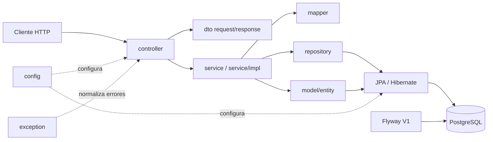
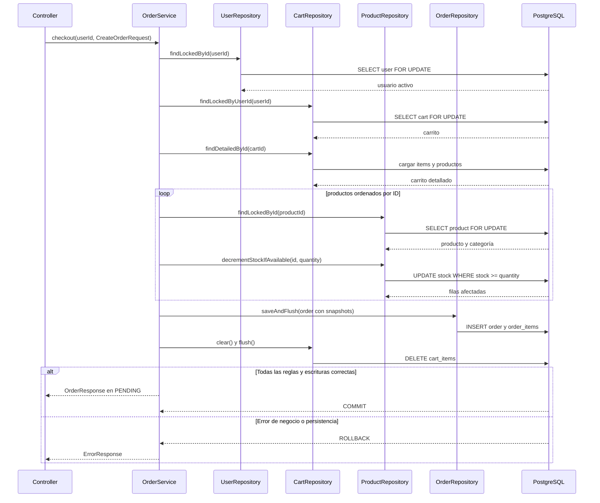

# Arquitectura del backend

## Propósito y alcance

NexoShop es un backend monolítico que expone una API REST para usuarios, catálogo, carritos y pedidos. La arquitectura prioriza separación de responsabilidades, persistencia relacional explícita y reglas de dominio verificables. No hay microservicios, eventos, caché ni integración con proveedores externos.

## Estilo y dependencias

El estilo es una arquitectura por capas dentro de un único proceso Spring Boot:



Reglas de dependencia:

- `controller` recibe HTTP y delega casos de uso; no contiene lógica de persistencia.
- `service` coordina transacciones y depende de interfaces de servicio y repositorios.
- `repository` encapsula Spring Data JPA y las consultas/locks requeridos.
- `model/entity` contiene estado y reglas invariantes del dominio.
- `mapper` convierte entidades a DTO de respuesta.
- `dto` no depende de entidades para definir el contrato HTTP.
- `config` configura auditoría y CORS.
- `exception` traduce fallos a `ErrorResponse` uniforme.
- `db/migration` es ejecutado por Flyway y no depende de Hibernate para crear el esquema.

## Responsabilidad de las capas

### `controller`

`UserController`, `CategoryController`, `ProductController`, `CartController` y `OrderController` definen las rutas bajo `/api/v1`, validan DTO mediante `@Valid` y parámetros mediante `@Positive`, `@Min` y `@Validated`. Devuelven DTO y códigos HTTP del contrato.

### `dto/request` y `dto/response`

Los records de `dto/request` validan entradas como cantidades, precios, emails, estados y datos de entrega. Los records de `dto/response` representan respuestas de usuario, catálogo, carrito, pedido y errores. Ninguno expone `passwordHash`.

### `mapper`

`UserMapper`, `CategoryMapper`, `ProductMapper`, `CartMapper` y `OrderMapper` proyectan entidades a respuestas. Las colecciones se entregan como copias no modificables y los detalles de pedido usan los snapshots persistidos.

### `service` y `service/impl`

Las interfaces `UserService`, `CategoryService`, `ProductService`, `CartService` y `OrderService` expresan casos de uso. Sus implementaciones aplican validaciones de negocio, normalización, traducción de conflictos de unicidad y límites transaccionales.

### `repository`

Los repositorios Spring Data proporcionan consultas, `EntityGraph` para cargar agregados necesarios y locks pesimistas para usuarios, carritos, productos y pedidos. `ProductRepository.decrementStockIfAvailable` ejecuta la actualización condicional del inventario.

### `model/entity`

Las entidades encapsulan cambios válidos: `Product` controla precio y stock, `Cart` administra sus `CartItem`, y `Order` controla detalles, totales y transiciones. `BaseEntity` centraliza identidad y timestamps auditados.

### `config`

`JpaAuditingConfig` activa `@CreatedDate` y `@LastModifiedDate`. `WebConfig` configura CORS para `/api/**`, métodos HTTP permitidos y orígenes definidos por `CORS_ALLOWED_ORIGINS`.

### `exception`

`GlobalExceptionHandler` traduce recursos inexistentes a 404, duplicados y reglas de negocio a 409, validaciones y solicitudes malformadas a 400, y errores inesperados a 500 sin detalles internos en la respuesta.

### Migraciones

`src/main/resources/db/migration/V1__create_initial_schema.sql` define las siete tablas, restricciones, índices y defaults. Flyway valida y aplica la migración; Hibernate no crea ni actualiza tablas.

## Flujo de una solicitud

Una solicitud HTTP llega a un controlador, se deserializa y valida contra un DTO. El controlador invoca una interfaz de servicio. La implementación recupera entidades mediante un repositorio, ejecuta las reglas de dominio dentro de una transacción, persiste los cambios y devuelve un DTO construido por un mapper. Las excepciones atraviesan `GlobalExceptionHandler` para producir el formato uniforme de error.

## Estructura simplificada de paquetes

```text
com.tobiasgaleano.nexoshop
├── config
├── controller
├── dto
│   ├── request
│   └── response
├── exception
├── mapper
├── model
│   ├── entity
│   ├── enums
│   └── valueobject
├── repository
├── service
│   └── impl
└── validation
```

## Transacciones y persistencia

Los servicios están marcados como lectura por defecto y cada operación de escritura declara `@Transactional`. `open-in-view=false` obliga a que los agregados requeridos se carguen dentro de los límites transaccionales mediante `EntityGraph` o consultas detalladas.

La configuración de ejecución usa PostgreSQL mediante `DB_URL`, `POSTGRES_USER` y `POSTGRES_PASSWORD`. En pruebas aisladas se usa H2; las pruebas de persistencia y API usan PostgreSQL/Testcontainers. El esquema se valida con `spring.jpa.hibernate.ddl-auto=validate` y Flyway mantiene `validate-on-migrate=true` y `clean-disabled=true`.

La auditoría JPA administra `created_at` y `updated_at`. El default SQL de `updated_at` establece el valor inicial de inserción; no existen triggers para sustituir la auditoría de la aplicación.

## Errores y CORS

Las respuestas de error contienen `timestamp`, `status`, `code`, `message`, `path` y `fieldErrors`. Las conversiones inválidas de parámetros y los cuerpos JSON ilegibles producen `MALFORMED_REQUEST` con HTTP 400. Los errores inesperados se registran internamente mediante SLF4J, pero la respuesta conserva `INTERNAL_ERROR` sin stack trace ni credenciales.

CORS se aplica a `/api/**`, permite `GET`, `POST`, `PUT`, `DELETE` y `OPTIONS`, acepta `Content-Type` y `Accept`, y no habilita credenciales. El origen predeterminado es `http://localhost:4200`.

## Concurrencia del inventario

El carrito verifica el stock disponible, pero no lo reserva ni lo descuenta. Checkout vuelve a validar usuario, carrito, producto, categoría y cantidad. Bloquea primero el usuario, después el carrito y finalmente los productos ordenados por ID. Para cada producto ejecuta:

```sql
UPDATE products
SET stock = stock - :quantity
WHERE id = :id AND stock >= :quantity
```

Solo una actualización que afecte una fila permite continuar. Si el stock es insuficiente o falla otra regla, la transacción se revierte. El orden estable de locks reduce el riesgo de deadlocks cuando varios carritos compiten por productos.

## Secuencia de checkout


