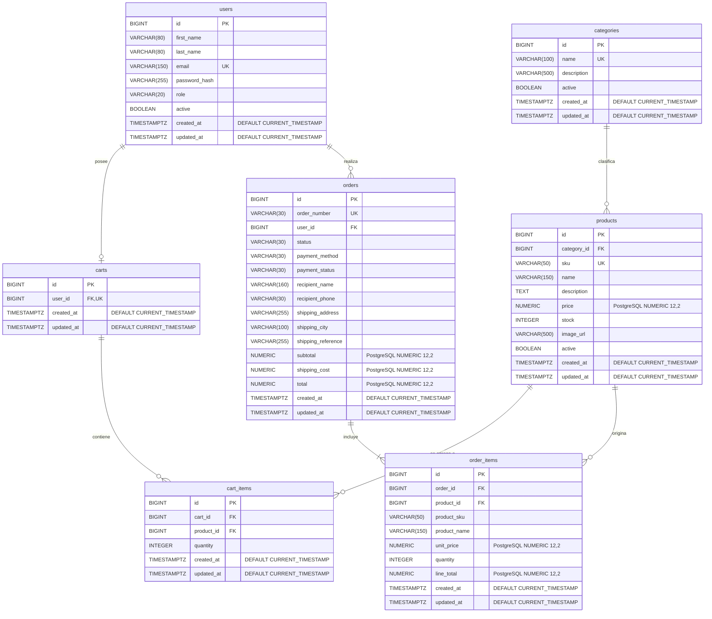

# Diagrama de Entidad-Relación de NexoShop

## Propósito

Este documento define el modelo relacional aprobado para la primera versión de NexoShop. Sirve como referencia conceptual del esquema implementado por las entidades JPA y la migración inicial de Flyway.

## Alcance

El modelo cubre usuarios clientes y administradores, categorías, productos y existencias, un carrito por usuario, pedidos, selección simulada del método de pago y conservación histórica de los artículos comprados. Contiene exactamente siete tablas: `users`, `categories`, `products`, `carts`, `cart_items`, `orders` y `order_items`.

En el diagrama, `PK` identifica claves primarias, `FK` claves foráneas y `UK` restricciones de unicidad. `TIMESTAMPTZ` representa el tipo PostgreSQL `TIMESTAMP WITH TIME ZONE`. Mermaid no admite comas dentro del token de tipo, por lo que los atributos monetarios muestran `NUMERIC` y consignan su precisión PostgreSQL exacta `NUMERIC(12,2)` en el comentario.

## Diagrama ER

La unicidad compuesta de `cart_items(cart_id, product_id)` no puede expresarse sobre un único atributo Mermaid; forma parte obligatoria del modelo y se detalla en las restricciones.

En las siete tablas, `created_at` y `updated_at` son obligatorios y utilizan `DEFAULT CURRENT_TIMESTAMP`. El valor predeterminado de `updated_at` solo establece el instante inicial durante la inserción; las modificaciones posteriores serán administradas por la futura aplicación mediante JPA. No se utilizarán triggers para actualizar automáticamente `updated_at`.

## Cardinalidades y relaciones

| Relación | Cardinalidad | Explicación |
|---|---|---|
| `users` → `carts` | 1 a 0..1 | Un usuario puede no tener carrito o tener uno; cada carrito pertenece a un único usuario. `carts.user_id` es obligatorio y único. |
| `users` → `orders` | 1 a 0..N | Un usuario puede no haber comprado todavía o realizar varios pedidos; cada pedido pertenece a un usuario. |
| `categories` → `products` | 1 a 0..N | Una categoría puede estar vacía o clasificar varios productos; cada producto requiere una categoría. |
| `carts` → `cart_items` | 1 a 0..N | Un carrito puede estar vacío o contener varios ítems; cada ítem pertenece a un carrito. |
| `products` → `cart_items` | 1 a 0..N | Un producto puede aparecer en varios carritos; cada ítem referencia un producto. |
| `orders` → `order_items` | 1 a 1..N | Todo pedido confirmado como unidad de negocio debe incluir al menos un detalle; cada detalle pertenece a un pedido. |
| `products` → `order_items` | 1 a 0..N | Un producto puede no haberse vendido o aparecer en muchos detalles históricos; cada detalle conserva su referencia al producto. |

La existencia de al menos un `order_items` por pedido debe validarse en la transacción de creación, porque una clave foránea por sí sola no puede imponer esa cardinalidad desde la tabla padre.

## Reglas de negocio y restricciones

- Todos los identificadores son `BIGINT`, claves primarias e identidades generadas por PostgreSQL.
- Todos los campos son obligatorios salvo `categories.description`, `products.description`, `products.image_url` y `orders.shipping_reference`.
- `users.email`, `categories.name`, `products.sku`, `carts.user_id` y `orders.order_number` son únicos.
- `users.email` se almacena normalizado en minúsculas. Además de la unicidad ordinaria, V1 aplica un índice único PostgreSQL basado en `lower(email)`.
- `categories.name` utiliza en V1 un índice único PostgreSQL basado en `lower(name)`, evitando nombres equivalentes que solo difieran en mayúsculas.
- `cart_items(cart_id, product_id)` es único: agregar nuevamente el mismo producto incrementa `quantity` y no crea otra fila.
- Todas las claves foráneas cuentan con un índice. Las restricciones únicas de `carts.user_id` y `cart_items(cart_id, product_id)` ya proporcionan un índice cuyo prefijo cubre `user_id` y `cart_id`; `cart_items.product_id` requiere otro índice.
- `products.price` y `order_items.unit_price` deben ser mayores que cero. Los subtotales, costos de envío y totales deben ser mayores o iguales que cero.
- `products.stock` es mayor o igual que cero. Las cantidades de carrito y pedido son mayores que cero.
- `orders.total = orders.subtotal + orders.shipping_cost`.
- `order_items.line_total = order_items.unit_price × order_items.quantity`.
- `order_items.product_sku`, `product_name` y `unit_price` son copias históricas inmutables tomadas al generar el pedido; no se recalculan desde `products`.
- `orders.recipient_name`, `recipient_phone`, `shipping_address`, `shipping_city` y `shipping_reference` forman una fotografía histórica de la entrega.
- `users.role` admite `CUSTOMER` y `ADMIN`.
- `orders.status` admite `PENDING`, `CONFIRMED`, `PREPARING`, `SHIPPED`, `DELIVERED` y `CANCELLED`.
- `orders.payment_method` admite `CREDIT_CARD`, `BANK_TRANSFER` y `CASH_ON_DELIVERY`.
- `orders.payment_status` admite `PENDING`, `PAID`, `FAILED` y `REFUNDED`.
- Los estados se representarán con `VARCHAR` y restricciones `CHECK`, no con tipos `ENUM` nativos de PostgreSQL.

## Política de eliminación

- Los usuarios, categorías y productos se desactivan mediante `active`; no se eliminan físicamente.
- Las referencias desde `products` a `categories`, desde los ítems a `products` y desde `orders` a `users` son restrictivas.
- Una categoría con productos y un producto referenciado no pueden eliminarse.
- Una eliminación técnica de `carts` elimina sus `cart_items` en cascada.
- Los pedidos y sus detalles son información histórica y no se eliminan físicamente. Las claves foráneas de `orders` y `order_items` usan política restrictiva.

## Decisiones de normalización

El modelo se mantiene en tercera forma normal: cada tabla representa un concepto, los atributos son atómicos y los datos no clave dependen de la clave de su entidad. Las asociaciones de muchos a muchos entre carritos y productos, y entre pedidos y productos, se resuelven mediante `cart_items` y `order_items`.

`order_items` aplica una desnormalización controlada: duplica SKU, nombre y precio unitario para preservar la compra tal como ocurrió aunque el catálogo cambie. Por la misma razón, la dirección de entrega se almacena directamente en `orders` como fotografía histórica y no como referencia a una dirección mutable.

La clase abstracta `BaseEntity` centraliza en Java `id`, `createdAt` y `updatedAt`, presentes en las siete tablas. Las entidades JPA usan `BigDecimal` para representar los valores `NUMERIC` y conservar precisión decimal.

## Exclusiones de alcance

No se crean tablas separadas para roles, pagos, direcciones, promociones, reseñas ni inventarios múltiples. Los métodos de pago son simulados y no existe integración real con bancos, procesadores de tarjetas u otras entidades financieras. El DER no contiene código Java ni migraciones SQL; esos artefactos implementan el modelo documentado aquí.
