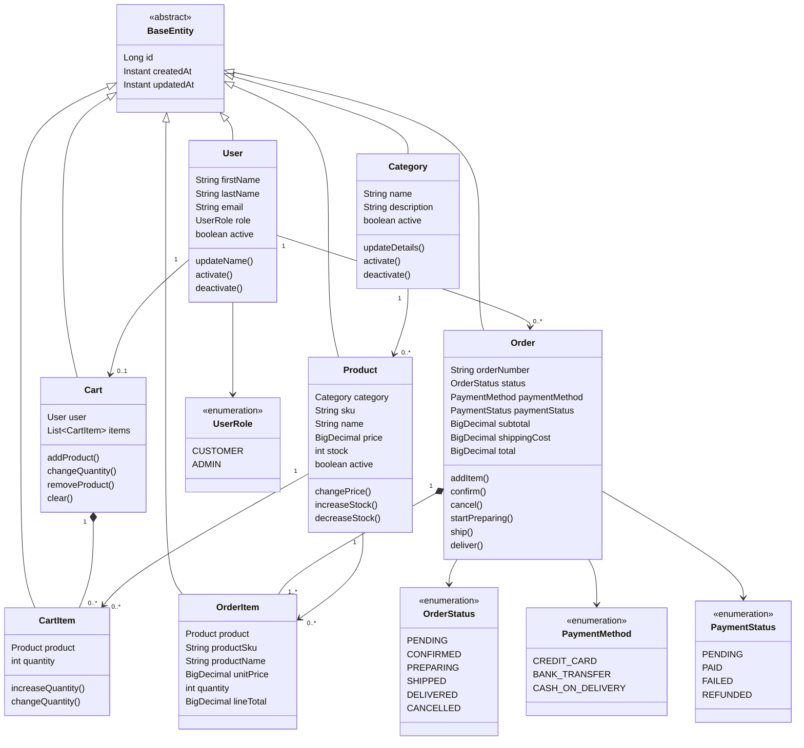
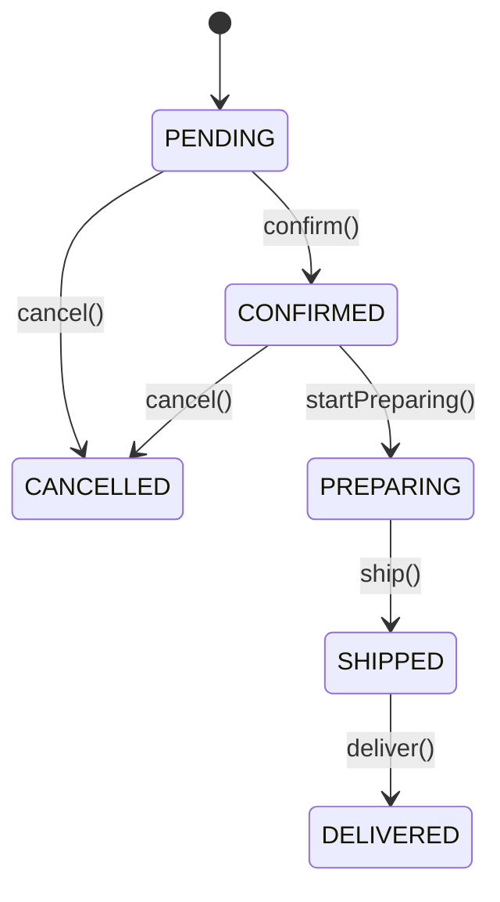
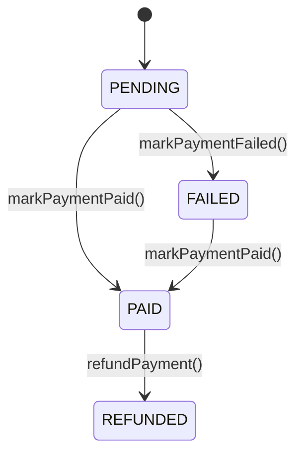

# Dominio, POO y reglas de negocio

## Modelo de dominio

El dominio está formado por `User`, `Category`, `Product`, `Cart`, `CartItem`, `Order` y `OrderItem`. Todas heredan identidad y auditoría de [`BaseEntity`](../src/main/java/com/tobiasgaleano/nexoshop/model/entity/BaseEntity.java). Los estados se modelan con `OrderStatus`, `PaymentStatus`, `PaymentMethod` y `UserRole`.

## Aplicación de POO

- **Encapsulamiento:** las entidades no exponen setters generales. `Product` modifica stock mediante `increaseStock` y `decreaseStock`; `Cart` coordina sus líneas; `Order` controla sus transiciones. Las colecciones se exponen como vistas no modificables. Véanse [`Product`](../src/main/java/com/tobiasgaleano/nexoshop/model/entity/Product.java), [`Cart`](../src/main/java/com/tobiasgaleano/nexoshop/model/entity/Cart.java) y [`Order`](../src/main/java/com/tobiasgaleano/nexoshop/model/entity/Order.java).
- **Abstracción:** `UserService`, `CategoryService`, `ProductService`, `CartService` y `OrderService` definen casos de uso mediante interfaces.
- **Herencia:** `BaseEntity` proporciona `id`, `createdAt` y `updatedAt` a las siete entidades.
- **Polimorfismo:** Spring inyecta las implementaciones `*ServiceImpl` detrás de sus interfaces en los controladores.
- **Composición:** `Cart` contiene `CartItem` con `cascade=ALL` y `orphanRemoval`; `Order` compone sus `OrderItem` para persistir los detalles del agregado.
- **Agregados:** `Cart` es la raíz de su carrito y `Order` es la raíz del pedido; sus métodos preservan invariantes de cantidades, detalles y totales.
- **Inyección e inversión de dependencias:** controladores y servicios reciben dependencias por constructor y dependen de abstracciones de servicio/repositorio.
- **Separación DTO-entidad:** los mappers [`UserMapper`](../src/main/java/com/tobiasgaleano/nexoshop/mapper/UserMapper.java), [`CartMapper`](../src/main/java/com/tobiasgaleano/nexoshop/mapper/CartMapper.java) y [`OrderMapper`](../src/main/java/com/tobiasgaleano/nexoshop/mapper/OrderMapper.java) evitan serializar entidades JPA.
- **Responsabilidad única:** los controladores gestionan HTTP, los servicios coordinan casos de uso, los repositorios persisten y las entidades protegen reglas de dominio.
- **Objeto de valor:** [`PasswordHash`](../src/main/java/com/tobiasgaleano/nexoshop/model/valueobject/PasswordHash.java) acepta únicamente codificaciones BCrypt válidas y no expone su valor codificado mediante un getter público.

## Diagrama de clases

## Reglas de negocio

### Usuarios y `PasswordHash`

El registro exige nombres, email válido y contraseña de 8 a 72 caracteres. El email se recorta y normaliza a minúsculas. `UserServiceImpl` codifica la contraseña con BCrypt, almacena solo el hash, asigna `CUSTOMER` y activa el usuario. `UserResponse` no contiene contraseña ni hash. No existe autenticación ni autorización en esta fase.

### Categorías

El nombre se recorta, no puede quedar vacío y tiene un máximo de 100 caracteres. La unicidad se comprueba ignorando mayúsculas y se refuerza en PostgreSQL con el índice funcional correspondiente. Las categorías se activan o desactivan; no se eliminan físicamente.

### Productos e inventario

Un producto requiere una categoría activa, SKU único, nombre, precio positivo representable con `NUMERIC(12,2)` y stock no negativo. Los cambios de precio y SKU pasan por métodos de dominio. Las operaciones de stock requieren cantidades positivas; `Math.addExact` evita desbordamientos en incrementos y nunca se permite stock negativo.

### Carritos

Cada usuario tiene como máximo un carrito. Agregar el mismo producto, incluso mediante otra instancia JPA o proxy con el mismo ID, incrementa la línea existente. Las cantidades deben ser positivas y no pueden superar el stock actual. El carrito no reserva stock: la disponibilidad se vuelve a validar durante checkout. Retirar líneas y vaciar el carrito elimina sus `CartItem` huérfanos.

### Checkout

Checkout exige usuario activo y carrito no vacío. Valida que cada producto y su categoría estén activos. Bloquea usuario, carrito y productos en orden estable, descuenta stock con una actualización condicional y crea el pedido con sus detalles históricos dentro de una única transacción. Si falla una regla, una cantidad o una escritura, se ejecuta rollback. El pedido se crea en estado `PENDING` y la confirmación ocurre mediante una transición posterior.

### Pedidos

Un pedido debe tener al menos un detalle. Solo un pedido `PENDING` puede recibir detalles adicionales. `confirm()` exige detalles y mueve el pedido a `CONFIRMED`; después las transiciones válidas son `PREPARING`, `SHIPPED` y `DELIVERED`. `cancel()` solo permite cancelar pedidos `PENDING` o `CONFIRMED` y la capa de servicio restituye el stock una sola vez.

Los detalles conservan `productSku`, `productName`, `unitPrice`, `quantity` y `lineTotal` como snapshots. Cambios posteriores en `Product` no modifican el histórico del pedido. Las restricciones de base de datos y la configuración JPA impiden eliminar accidentalmente pedidos y detalles históricos.

### Pagos simulados

El método de pago puede ser `CREDIT_CARD`, `BANK_TRANSFER` o `CASH_ON_DELIVERY`; no hay integración financiera real. El estado comienza en `PENDING`. Puede pasar a `PAID` o `FAILED`; un pago `FAILED` puede reintentarse y pasar a `PAID`. Solo un pago `PAID` puede pasar a `REFUNDED`.

### Cálculos monetarios

`MonetaryAmount` exige como máximo dos decimales y la capacidad de `NUMERIC(12,2)`. Los precios unitarios son positivos; subtotal, envío y total son no negativos. `Order` mantiene `subtotal` como suma de líneas y `total = subtotal + shippingCost`; cada `OrderItem` mantiene `lineTotal = unitPrice × quantity`.

### Errores de negocio

La API usa `ErrorResponse` uniforme. Recursos inexistentes producen 404; duplicados, stock insuficiente, estados inválidos y reglas de dominio producen 409; validaciones, JSON ilegible, enums inválidos y parámetros no convertibles producen 400. Los errores inesperados se registran internamente y se presentan como `INTERNAL_ERROR` sin detalles sensibles.

## Estados logísticos del pedido

No hay transiciones de salida desde `DELIVERED` o `CANCELLED`.

## Estados del pago

Los estados de pago son simulados y se gestionan independientemente de la integración de proveedores externos, que está fuera de alcance.
